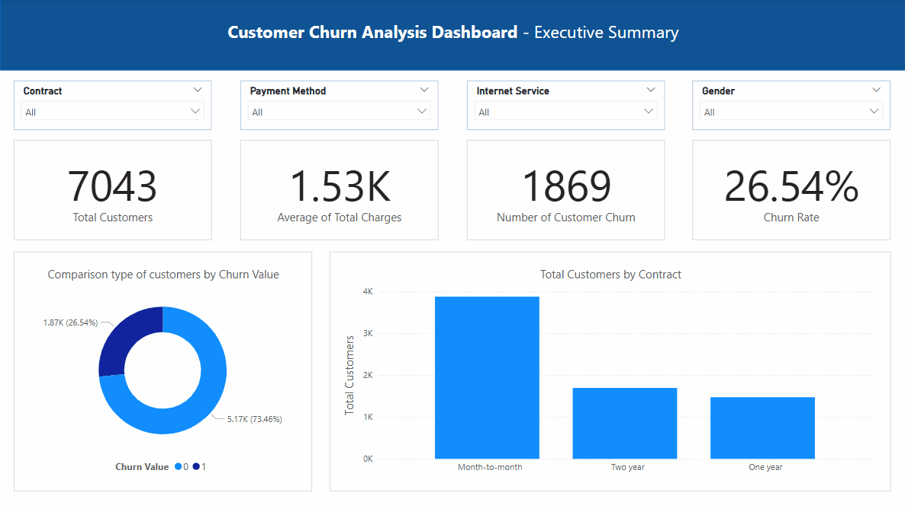
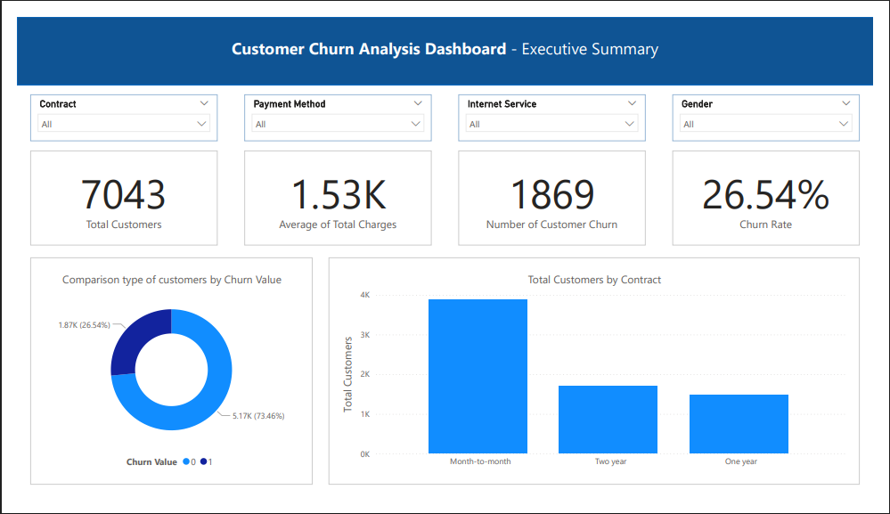
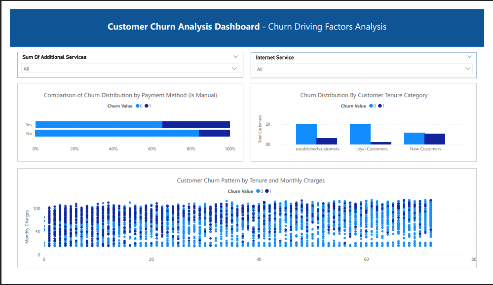
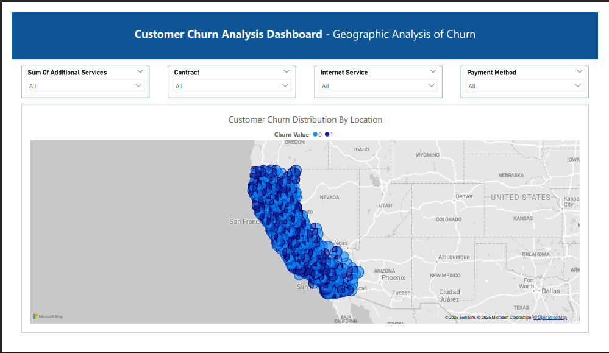

# Analisis dan Prediksi Customer Churn Telekomunikasi (End-to-End Data Science Project)

## Daftar Isi

1.  [Latar Belakang & Tujuan Proyek](#-latar-belakang-tujuan-proyek)
2.  [Apa itu Customer Churn?](#-apa-itu-customer-churn)
3.  [Sumber Data](#-sumber-data)
4.  [Teknologi yang Digunakan](#️-teknologi-yang-digunakan)
5.  [Alur Kerja Proyek](#️-alur-kerja-proyek)
6.  [Temuan Kunci dari Analisis Data (EDA)](#-temuan-kunci-dari-analisis-data-eda)
7.  [Hasil Pemodelan Machine Learning](#-hasil-pemodelan-machine-learning)
8.  [Dashboard Interaktif Power BI](#-dashboard-interaktif-power-bi)
9.  [Cara Menjalankan Proyek Ini](#-cara-menjalankan-proyek-ini)

## Latar Belakang & Tujuan Proyek

Proyek ini bertujuan untuk melakukan analisis terhadap data pelanggan dari sebuah perusahaan telekomunikasi untuk mengidentifikasi faktor-faktor utama yang kemungkinan menyebabkan *customer churn* (pelanggan berhenti berlangganan). Tujuan akhir dari proyek ini adalah membangun sebuah model *machine learning* yang dapat memprediksi pelanggan mana yang berisiko akan churn, sehingga perusahaan dapat mengambil langkah yang cepat dan tepat untuk mengurangi jumlah pelanggan yang churn sehingga mengurangi kerugian pendapatan.

## Apa itu Customer Churn?

**Customer churn** adalah istilah yang digunakan untuk menggambarkan kondisi di mana pelanggan memutuskan untuk berhenti menggunakan produk atau layanan dari suatu perusahaan dan beralih ke penyedia lain atau tidak lagi menjadi pelanggan aktif.

Mengapa metrik ini sangat penting? Karena biaya untuk mengakuisisi pelanggan baru **jauh lebih mahal** (bisa 5 hingga 25 kali lipat) dibandingkan biaya untuk mempertahankan pelanggan yang sudah ada. Oleh karena itu, kemampuan untuk memprediksi churn secara proaktif sangat berharga bagi bisnis, terutama yang berbasis langganan seperti telekomunikasi, streaming, dan SaaS (Software as a Service). Proyek ini berfokus pada **voluntary churn**, di mana pelanggan secara aktif memilih untuk menghentikan layanan.

## Sumber Data

Dataset yang digunakan dalam proyek ini adalah versi modifikasi dari dataset publik "Telco Customer Churn" yang tersedia di Kaggle.

* **Sumber Data Asli:** [Telco Customer Churn by Abdallah Wagih Ibrahim](https://www.kaggle.com/datasets/abdallahwagih/telco-customer-churn)
* **Dataset yang Digunakan untuk training:** Dataset yang sudah diperkaya dan disimpan di [folder /data/processed/](./data/processed/) di repository ini.

## Teknologi yang Digunakan

* **Bahasa Pemrograman:** Python
* **Library Analisis Data:** Pandas, NumPy
* **Library Visualisasi Data:** Matplotlib, Seaborn
* **Library Machine Learning:** Scikit-learn, Imbalanced-learn
* **Library Deep Learning:** TensorFlow (Keras)
* **Library Hyperparameter Tuning:** KerasTuner
* **Dashboarding:** Microsoft Power BI

## Alur Kerja Proyek

Proyek ini mengikuti alur kerja *end-to-end data science* yang sistematis:
1.  **Pembersihan Data:** Menangani nilai yang hilang dan memperbaiki tipe data yang tidak konsisten.
2.  **Analisis Data Eksploratif (EDA):** Menggali wawasan dan memahami pola dari data melalui visualisasi.
3.  **Rekayasa Fitur (Feature Engineering):** Membuat fitur-fitur baru yang lebih informatif seperti klaster geografis, jumlah layanan, dan rasio finansial untuk meningkatkan performa model.
4.  **Perbandingan Model Klasik:** Menguji ~9 model machine learning klasik untuk mendapatkan *baseline* performa yang solid.
5.  **Penanganan Data Tidak Seimbang:** Menerapkan teknik SMOTE pada data training untuk mengatasi masalah kelas minoritas.
6.  **Optimasi & Hyperparameter Tuning:** Melakukan tuning sistematis pada model ANN menggunakan KerasTuner untuk menemukan arsitektur terbaik.
7.  **Evaluasi Model Final:** Mengevaluasi model ANN terbaik pada data uji dan melakukan optimasi *threshold* untuk memaksimalkan F1-Score.
8.  **Visualisasi Dashboard:** Membuat dashboard interaktif di Power BI untuk menyajikan insight kepada audiens bisnis.

## Insight dari Analisis Data (EDA)

* **Insight 1:** Basis pelanggan yang tergambarkan dalam dataset ini sangat didominasi oleh demografi usia non-senior (dewasa muda dan paruh baya). Ini bisa berarti strategi pemasaran dan produk perusahaan selama ini lebih berhasil menarik segmen tersebut.
* **Insight 2:** Tantangan churn yang terlihat dari data ini memiliki dua sumber utama: daya tarik kompetitor dari luar dan masalah dengan kualitas layanan perusahaan sendiri. Karena itu, upaya untuk mempertahankan pelanggan harus fokus pada kedua hal tersebut sekaligus.
* **Insight 3:** Pelanggan dengan kontrak **Month-to-month** (bulanan) secara signifikan lebih rentan untuk berhenti berlangganan (churn) dibandingkan pelanggan dengan kontrak jangka panjang.

## Hasil Pemodelan Machine Learning

Setelah melalui beberapa tahap optimasi, termasuk *hyperparameter tuning* dan *threshold optimization*, model final **Artificial Neural Network (ANN)** berhasil mencapai performa sebagai berikut pada data uji:
* **Accuracy : 0.8006**

## Dashboard Interaktif Power BI

Berikut adalah pratinjau dari dashboard Power BI yang telah dibuat untuk visualisasi analisis churn.

### Demonstrasi Interaktif


### Halaman 1: Ringkasan Eksekutif


### Halaman 2: Analisis Faktor Pendorong Churn


### Halaman 3: Analisis Geografis


*Untuk laporan lengkap dalam format PDF, silakan lihat file `Customer_Churn_Analysis.pdf` di dalam folder `/reports/`.*

## Cara Menjalankan Proyek Ini

1.  **Clone repository ini:**
    ```bash
    git clone [https://github.com/giastahmad/telco-churn-data-science-project.git](https://github.com/giastahmad/telco-churn-data-science-project.git)
    cd telco-churn-data-science-project
    ```
2.  **Install semua library yang dibutuhkan:**
    ```bash
    pip install -r requirements.txt
    ```
3.  **Buka Notebook:**
    Buka file `.ipynb` yang ada di dalam folder `/notebooks/` menggunakan Jupyter Notebook atau editor sejenisnya.