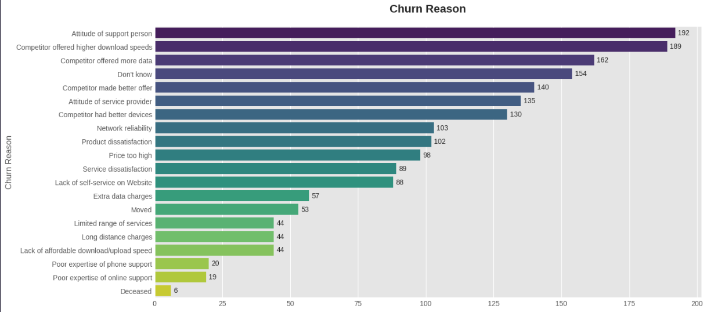

# Telecommunication Customer Churn Analysis and Prediction (End-to-End Data Science Project)

## Table of Contents

1.  [Background & Project Objectives](#background--project-objectives)
2.  [What is Customer Churn?](#what-is-customer-churn)
3.  [Data Source](#data-source)
4.  [Technologies Used](#technologies-used)
5.  [Project Workflow](#project-workflow)
6.  [Insights from Data Analysis (EDA)](#insights-from-data-analysis-eda)
7.  [Machine Learning Modeling Results](#machine-learning-modeling-results)
8.  [Interactive Power BI Dashboard](#interactive-power-bi-dashboard)
9.  [How to Run This Project](#how-to-run-this-project)

## Background & Project Objectives

This project aims to analyze customer data from a telecommunications company to identify the main factors that likely cause *customer churn*. The ultimate goal of this project is to build a *machine learning* model that can predict which customers are at risk of churning, allowing the company to take swift and appropriate action to reduce the number of churning customers and thus minimize revenue loss.

## What is Customer Churn?

**Customer churn** is a term used to describe the condition where customers decide to stop using a company's products or services and switch to another provider or are no longer active customers.

Why is this metric so important? Because the cost of acquiring new customers is **far more expensive** (can be 5 to 25 times more) than the cost of retaining existing customers. Therefore, the ability to proactively predict churn is highly valuable for businesses, especially those based on subscriptions like telecommunications, streaming, and SaaS (Software as a Service). This project focuses on **voluntary churn**, where customers actively choose to discontinue the service.

## Data Source

The dataset used in this project is a modified version of the public "Telco Customer Churn" dataset available on Kaggle.

* **Original Data Source:** [Telco Customer Churn by Abdallah Wagih Ibrahim](https://www.kaggle.com/datasets/abdallahwagih/telco-customer-churn)
* **Dataset Used for Training:** The enriched dataset stored in the [/data/processed/](./Data/processed/) folder in this repository.

## Technologies Used

* **Programming Language:** Python
* **Data Analysis Libraries:** Pandas, NumPy
* **Data Visualization Libraries:** Matplotlib, Seaborn
* **Machine Learning Libraries:** Scikit-learn, Imbalanced-learn
* **Deep Learning Library:** TensorFlow (Keras)
* **Hyperparameter Tuning Library:** KerasTuner
* **Dashboarding:** Microsoft Power BI

## Project Workflow

This project follows a systematic *end-to-end data science* workflow:
1.  **Data Cleaning:** Checking for missing values and correcting inconsistent data types.
    ```python
    df.isnull().sum()

    df.duplicated().sum()
    ```
2.  **Exploratory Data Analysis (EDA):** Uncovering insights and understanding patterns from the data through visualization. One example:
    ```python
    top_10_Cities = df.City.value_counts().head(10)

    plt.figure(figsize=(12,6))
    plt.style.use('ggplot')
    sns.barplot(x=top_10_Cities.index, y=top_10_Cities.values, palette='viridis')
    plt.title('Top 10 Cities')
    plt.xlabel('City')
    for i, count in enumerate(top_10_Cities.values):
        plt.text(i, count + 15, str(count), ha='center')
    plt.xticks(rotation=45)
    plt.show()
    ```
    

3.  **Feature Engineering:** Creating new, more informative features such as the number of services, financial ratios, and customer categories to improve model performance.
    ```python
    additional_services_cols = [
        'Online Security_Yes',
        'Online Backup_Yes',
        'Device Protection_Yes',
        'Tech Support_Yes',
        'Streaming TV_Yes',
        'Streaming Movies_Yes'
    ]

    df['Sum Of Additional Services'] = df[additional_services_cols].sum(axis=1)
    ```
    ```python
    df['Monthly Charges to Tenure Ratio'] = df['Monthly Charges'] / (df['Tenure Months'] + 1)
    ```
    ```python
    bins = [0,12,100]
    labels = ['New Customers','Loyal Customers']
    df['Tenure Category'] = pd.cut(df['Tenure Months'], bins=bins, labels=labels, right=False)
    ```

4.  **Handling Imbalanced Data:** Applying the SMOTE technique to the training data to address the minority class problem.
    ```python
    smote = SMOTE(random_state=42)
    x_train_resampled, y_train_resampled = smote.fit_resample(x_train_scaled, y_train)
    ```

5.  **Comparison of Classic Models:** Testing ~9 classic machine learning models to get a solid performance *baseline*.
    ```python
    models = [
        ('Logistic Regression', LogisticRegression()),
        ('Decision Tree', DecisionTreeClassifier()),
        ('Random Forest', RandomForestClassifier()),
        ('AdaBoost Classifier', AdaBoostClassifier()),
        ('Gradient Boosting Classifier', GradientBoostingClassifier()),
        ('XGBClassifier', XGBClassifier()),
        ('LGBMClassifier', LGBMClassifier(verbose=-1)),
        ('CatBoostClassifier', CatBoostClassifier(verbose=False)),
        ('KNN', KNeighborsClassifier())
    ]

    results = []
    for name, model in models:
        model.fit(x_train_resampled, y_train_resampled)
        
        y_train_pred = model.predict(x_train_resampled)
        y_test_pred = model.predict(x_test_scaled)
        
        train_score = model.score(x_train_resampled, y_train_resampled)
        test_score = model.score(x_test_scaled, y_test)
        
        accuracy = accuracy_score(y_test, y_test_pred)
        recall = recall_score(y_test, y_test_pred)
        precision = precision_score(y_test, y_test_pred)
        f1 = f1_score(y_test, y_test_pred)
        confusion = confusion_matrix(y_test, y_test_pred)
        
        results.append({
           'Model': name,
            'Accuracy': accuracy,
            'Recall': recall,
            'Precision': precision,
            'F1 Score': f1
        })

    results_df = pd.DataFrame(results)
    results_df_sorted = results_df.sort_values(by='Accuracy', ascending=False).reset_index(drop=True)
    display(results_df_sorted)

    best_model_name = results_df_sorted.iloc[0]['Model']
    best_accuracy = results_df_sorted.iloc[0]['Accuracy']

    print(f"\nBest Model based on Accuracy: {best_model_name}")
    print(f"Accuracy: {best_accuracy:.4f}")
    ```

6.  **Optimization & Hyperparameter Tuning:** Performing systematic tuning on the ANN model using KerasTuner to find the best architecture.
    ```python
    def build_model(hp):
        model = Sequential()
        
        input_dim = x_train_resampled.shape[1]
        model.add(Input(shape=(input_dim,)))

        hp_units_1 = hp.Int('units_1', min_value=32, max_value=128, step=32)
        model.add(Dense(units=hp_units_1, activation='relu'))

        hp_dropout_1 = hp.Float('dropout_1', min_value=0.2, max_value=0.5, step=0.1)
        model.add(Dropout(rate=hp_dropout_1))

        hp_units_2 = hp.Int('units_2', min_value=16, max_value=64, step=16)
        model.add(Dense(units=hp_units_2, activation='relu'))
        
        model.add(Dense(1, activation='sigmoid'))

        hp_learning_rate = hp.Choice('learning_rate', values=[1e-2, 1e-3, 1e-4])

        model.compile(
            optimizer=Adam(learning_rate=hp_learning_rate),
            loss='binary_crossentropy',
            metrics=['accuracy','recall']
        )
        
        return model
    ```
    ```python
    tuner = kt.RandomSearch(
        build_model,
        objective=kt.Objective("val_accuracy", direction="max"),
        max_trials=20,
        executions_per_trial=1,
        directory='ann_tuning',
        project_name='churn_prediction'
    )
    ```
    ```python
    early_stopping = EarlyStopping(monitor='val_accuracy', patience=10, restore_best_weights=True, verbose=1)

    tuner.search(
        x_train_resampled,
        y_train_resampled,
        epochs=100,
        validation_split=0.2,
        callbacks=[early_stopping]
    )

    best_hps = tuner.get_best_hyperparameters(num_trials=1)[0]
    ```

7.  **Final Model Evaluation:** Evaluating the best ANN model on the test data and performing *threshold* optimization to maximize Accuracy.
    ```python
    thresholds = np.linspace(0.0, 1.0, num=100)
    accuracies = []

    for thresh in thresholds:
        y_pred_thresh = (y_pred_proba >= thresh).astype(int)
        acc = accuracy_score(y_test, y_pred_thresh)
        accuracies.append(acc)

    best_location = np.argmax(accuracies)
    best_threshold = thresholds[best_location]
    best_accuracy = accuracies[best_location]

    print(f"Best Threshold for Accuracy: {best_threshold:.4f}")
    print(f"Best Accuracy: {best_accuracy:.4f}")

    plt.figure(figsize=(10, 6))
    plt.plot(thresholds, accuracies, 'm-', label='Accuracy', linewidth=2)
    plt.axvline(x=best_threshold, color='k', linestyle='--', label=f'Optimal Threshold ({best_threshold:.2f})')

    plt.title('Accuracy vs. Threshold')
    plt.xlabel('Threshold')
    plt.ylabel('Accuracy')
    plt.legend(loc='best')
    plt.grid(True)
    plt.show()
    ```
    ```python
    y_pred_ann = (y_pred_proba > best_threshold).astype(int)

    accuracy_ann = accuracy_score(y_test, y_pred_ann)
    print(f"Accuracy Score ANN on Test Data: {accuracy_ann:.4f}")
    ```

8.  **Dashboard Visualization:** Creating an interactive dashboard in Power BI to present insights to a business audience.

## Insights from Data Analysis (EDA)

* **Insight 1:** The customer base depicted in this dataset is heavily dominated by the non-senior age demographic (young and middle-aged adults). This could mean that the company's marketing and product strategies have been more successful in attracting this segment.
    

* **Insight 2:** The churn challenge observed in this data has two main sources: the appeal of external competitors and issues with the company's own service quality. Therefore, efforts to retain customers must focus on both aspects simultaneously.
    

* **Insight 3:** Customers with **Month-to-month** contracts are significantly more prone to churn compared to customers with long-term contracts.
    

## Machine Learning Modeling Results

After undergoing several optimization stages, including *hyperparameter tuning* and *threshold optimization*, the final **Artificial Neural Network (ANN)** model achieved the following performance on the test data:
* **Accuracy: 0.8006**

**Public Notebook (Kaggle)**
* To view the notebook with all cell outputs already executed interactively, please visit the following link:
* **[Open Notebook on Kaggle](https://www.kaggle.com/code/giastahmad/telco-churn-prediction-eda-ann-tuning)**

## Interactive Power BI Dashboard

Here is a preview of the Power BI dashboard created for churn analysis visualization.

### Interactive Demonstration


### Page 1: Executive Summary


### Page 2: Churn Driving Factor Analysis


### Page 3: Geographic Analysis


*For the complete report in PDF format, please see the `Customer_Churn_Analysis.pdf` file in the `/reports/` folder.*

## How to Run This Project

1.  **Clone this repository:**
    ```bash
    git clone [https://github.com/giastahmad/telco-churn-data-science-project.git](https://github.com/giastahmad/telco-churn-data-science-project.git)
    cd telco-churn-data-science-project
    ```
2.  **Install all required libraries:**
    ```bash
    pip install -r requirements.txt
    ```
3.  **Open the Notebook:**
    Open the `.ipynb` file located in the `/notebooks/` folder using Jupyter Notebook or a similar editor.